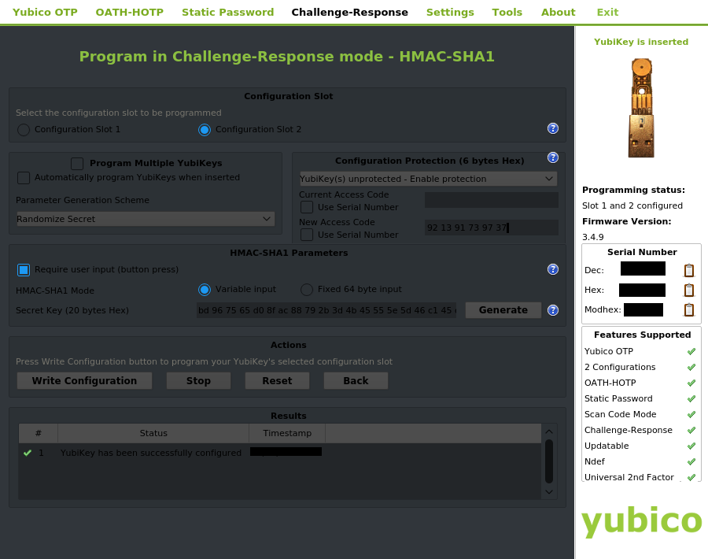
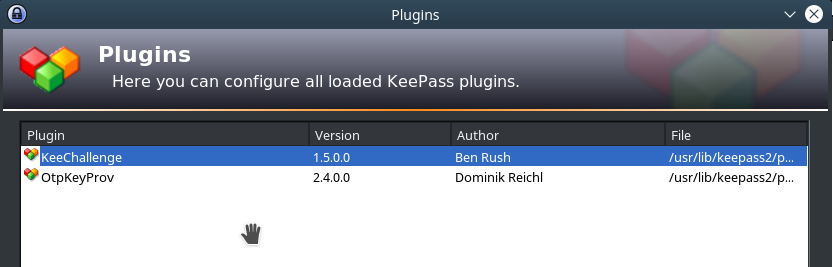
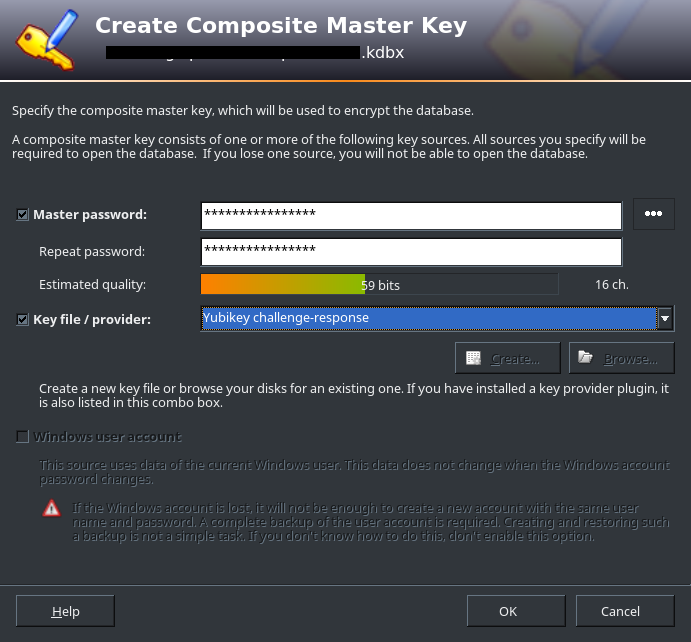
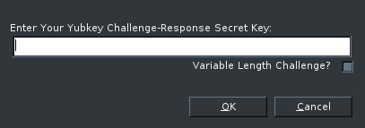

# Using Yubikey to log into Ubuntu

_In construction_

# Using the Yubikey and Yubico Authenticator to protect your Google Authenticator (or other TOTP application) codes

_In construction_

**References**

- https://www.yubico.com/wp-content/uploads/2016/05/Yubico_Authenticator_en.pdf

# Using the Yubikey U2F Authentication in Websites

_In construction_

# Using a Keepass and Yubikey Challenge-Response solution

## Configuring Yubikey to use HMAC-SHA1 challenge-response authentication

1. Download the Yubikey Personalization tool from the [yubikey website](https://www.yubico.com/support/knowledge-base/categories/articles/yubikey-personalization-tools/) or install using apt:

		sudo apt-get install yubikey-personalization-gui

2. Open the Yubikey Personalization Tool and go to Challenge-Response

	

3. As the image above shows, configure as follows:
	- Choose configuration slot 2;
	- Choose to activate the configuration protection as a user defined 6 bytes hex (do not use the serial number as the code);
		- _**Warning**_: if the configuration protection is set you won't be able to reprogram or erase the configuration in the key, save the code somewhere safe to avoid any headaches.
	- Check the box "Require user input(button press)" as this will make the yubikey wait for your touch before answering to the challenge;
	- Select Fixed 64 byte input;
	- Generate a Secret Key and **save it somewhere safe**;
	- Finally select "Write Configuration" and the key should now be configured.

## Install KeePass and KeeChallenge

On Ubuntu do:

1. Install KeePass2

		sudo apt-get install keepass2 mono-complete

2. Download the KeeChallenge plugin:
	- Download the zip file from http://brush701.github.io/keechallenge/;

3. Inside the zip find the `KeeChallenge.dll.config` file and edit the following line as shown. Ajust the path to you system, the command `find /usr/lib -name libykpers*` may help.

		```
		<?xml version="1.0"?>
		<configuration>
		<dllmap dll="libykpers-1-1.dll" target="/usr/lib/x86_64-linux-gnu/libykpers-1.so.1"/>
		</configuration>
		```

4. Copy both `KeeChallenge.dll` and `KeeChallenge.dll.config` to the KeePass plugins folder `/usr/lib/keepass2/plugins/` (run `whereis keepass2` if you are not sure where KeePass is).

5. Open KeePass and go to `Tools > Plugins`. Make sure the KeeChallenge plugin is showing in the listing.

	

6. _Optional Aesthetic Improvement:_ If your tray icon is buggy due to mono issues install the `keepass2-plugin-status-notifier` fix. For KDE this was the most Aesthetic one but see the keebuntu page for more info and other fixes.

		sudo apt-add-repository ppa:dlech/keepass2-plugins-beta
		sudo apt-get update
		sudo apt-get install keepass2-plugin-status-notifier

## Protect a database with the Yubikey Challenge-Response mode

1. To protect an existant KeePass database go to `File > Change Master Key` and follow the instructions bellow;

2. To protect a newly created database just go to `File > New` and save the database somewhere;

3. In the Create Composite Master Key window choose the master password and select "Yubikey challenge-response" as the Key provider.

	

4. After pressing ok, the following window appears so that you can you can insert the Secret Key that you have programmed your Yubikey with.

	

5. The database is now protected with your Yubikey + Master Key combination.


# References

- http://brush701.github.io/keechallenge/
- https://github.com/dlech/Keebuntu
- http://www.kahusecurity.com/2014/securing-keepass-with-a-second-factor/
- https://www.yubico.com/why-yubico/for-individuals/password-managers/keepass/
- https://b3n.org/yubikey-two-factor-authentication/
- https://www.shivering-isles.com/keepass-the-place-for-all-your-keys-and-passwords/
- https://www.raymond.cc/blog/setting-up-yubikey-with-lastpass-as-second-factor-authentication/
- https://www.reddit.com/r/KeePass/comments/51rxsr/how_do_you_use_keepass_workflow_plugins_etc/